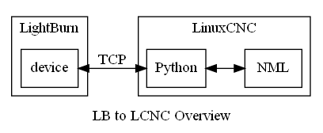

# LightBurn_to_LinuxCNC
Python Interface for LCNC that provides a TCP server so Lightburn can talk to LCNC.

The Lightburn(LB) commercial software does a great job with generating laser gcode for many laser cutters including LinuxCNC.
LB can also directly control laser devices with several communication links including TCP.

This project is intended to provide a LinuxCNC UI written in Python that can act as a LB TCB device .

## LB functionality
  LB has a nice interface and set of UI features well honed to laser cutting.
- Homing (G28 Marlin FW)
- WorkSpace location (G92/G54)
- Laser offsets
- Get current position (M114 Marlin FW)
- Run/Pause/Stop
- Outline laser area.

### LCNC functionality for laser cutting
On the LCNC side, python will be act as a TCP server between LB and LCMC NML (command, status, error). 
Ideally, this UI will function in limited conjuction with an existing LCNC UI. 

## Other
For a F360 Post processor that works with LCNC laser limited to cutting, see https://github.com/JTrantow/LinuxCNC-F360-Cutting-Post-Processor
